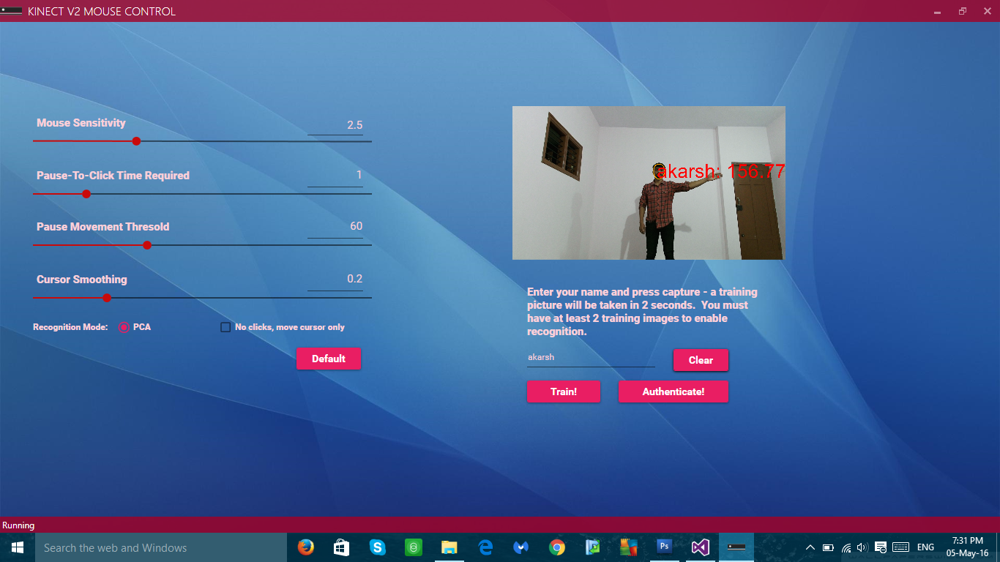

# gesture-recognition-app
This is a windows desktop application for gesture recognition and their mapping to various mouse and keyboard inputs.

## Overview
The **WPF** application aims at controlling mouse and keyboard inputs with innovatively mapped hand gestures(both continuous and discrete). 
The application authenticates and also dynamically authorizers users to use gestures for interactive control over the system. 
The **intuitive UI** design helps users set sensitivity and allows them to create authorization profiles dynamically.

## Microsoft Kinect V2 and SDK
Kinect is a motion sensing input device by Microsoft for the **Xbox 360** video game console and Windows
PCs. Based around a webcam-style add-on peripheral for the Xbox 360 console, it enables users to control and
interact with the Xbox 360 without the need to touch a game controller, through a natural user interface using gestures
and spoken commands. Kinect Studio is a tool provided by **Microsoft Kinect SDK 2.0** to record the gestures.
This recorded gesture is a raw *.xrf* file which then has to be converted into an executable *.xef clip*. The gesture is then
trained for true and false values using **Visual Gesture Builder**. The trained gesture is then stored in a database which
can be imported in a Visual Studio Project to bind actions to this gesture.

## User Authorization
Microsoft Kinect V2 comes with powerful infrared sensers and depth sensers which can detect upto 6 skeletal frames at once. 
However, the challenge here is to identify the authorized users in real-time. 
This can be achieved with face recognition. For this we use dimensionality reduction using **PCA**(Principal Component Analysis) and *Eigen Faces*[1]. 
These are low level features for grey scale images of faces that then can be compared with newly captured images at real time. 
Authorized users will be allowed to use gestures to control the system. New users can be added and authorized dynamically using the same tool.

## Results

The tool comes with two sections: *Settings* and *Authentication*.  

Gestures are built using Microsoft Kinect Visual Gesture Builder tool provided by Microsoft. 

## Bibliography

[1]. Abhishek Singh,“Face Recognition Using PCA and Eigen Face Approach”, Journal of National Institute of Technology, Rourkela,
3rdSeptember 2012
[2]. D.M. Hobson, R.M. Carter, Y.Yan, “Interactive Gesture Recognition”, Information Technology Conference IMTC 2012
Warsaw, Poland, May 1-3, 2012
[3]. J.L. Raheja, A.Chaudhary, K.Singal, “Tracking of Fingertips and Centre of Palm using KINECT”, IEEE International Conference on
Computational Intelligence, Modelling and Simulation, Malaysia, 20-22 Sep, 2011, pp. 248-252.
[4]. M. A. Turk and A. P. Pentland,“Eigenfaces for Recognition”, Journal of Cognitive Neuroscience, 3(1):7186, 1991
[5]. Anil K. Jain, Robert P.W. Duin, and Jianchang Mao,“Statistical Pattern Recognition: A Review”, IEEE Transactions on Pattern
Analysis and Machine Intelligence, 22(1):4, 37thJanuary 2000.
[6]. Abhijith Jana, Kinect for Windows SDK programming guide.
